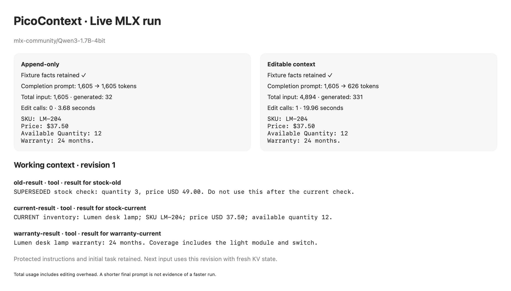

# Prototype validation

Verified on September 30, 2026 on an Apple M1 Max with 32 GB memory, macOS
26.6.2 and the installed Apple Swift **6.4** compiler. The manifest requires
tools **6.2**, Swift 6 language mode, macOS 15 and iOS 18. An actual Swift 6.2
toolchain and macOS 15 / iOS 18 devices were not available on this host, so those
runtime/compiler combinations are not claimed as tested.

## Checks performed

- Default manifest: zero dependencies; only `PicoContext` and `PicoContextTests`.
- Core build and **29 Swift Testing tests passed**, including parameterized cases.
  Review regression coverage includes caller edits/repeated runs and runtime receipt
  collisions with retained and deleted caller IDs, including retry/acceptance feedback.
  Persistence failures retain the current revision, report the storage error and
  stop without requesting another model edit.
  Further regressions verify that an unrenderable historical metric cannot stop a
  repaired current context, accepted parallel tool groups fit one atomic deletion,
  and rejected model delimiters cannot poison bounded retry prompts.
- **4 opt-in MLX adapter tests passed** (57 cases across parameterized tests), without
  loading weights or running inference. They reject Qwen chat/tool-wrapper delimiters in message text,
  record IDs, tool IDs/names and control metadata; safe metadata preserves roles/links
  and escaped tool arguments round-trip without changing their JSON value.
- Core cross-build passed with `--triple arm64-apple-ios18.0` and the installed
  iPhoneOS SDK. No iOS example is shipped.
- Optional adapter and macOS SwiftUI executable built with Swift Build; the MLX
  Metal resource bundle compiled successfully. The current build engine emits
  an upstream resource-bundle bookkeeping warning (`missing creator for mutated
  node`); the app loaded the Metal library and completed real GPU inference.
- The documented packaging/run script built and launched an ad-hoc signed app.
- The live model generated an accepted edit; the actual completion used revision 1
  and its prepared token IDs. The final input retained original roles and tool
  relationships, protected instructions/task, exact current facts, and the edit
  acknowledgement. KV state was rebuilt for each call.
- `git diff --check` and `bash -n Scripts/run-example.sh` passed.

## Recorded live run

Model: `mlx-community/Qwen3-1.7B-4bit`, revision
`3b1b1768f8f8cf8351c712464f906e86c2b8269e`.
Dependencies: mlx-swift-lm **2.31.3**, mlx-swift **0.31.3**; complete versions
are recorded in [MLX-Package.resolved](MLX-Package.resolved). Greedy decoding, fresh KV state, identical
fixture/task and completion budgets for both modes.

| Measurement | Append-only | Editable |
|---|---:|---:|
| Fixture answer check | Passed | Passed |
| Original completion prompt | 1,605 | 1,605 |
| Actual final prompt | 1,605 | 626 |
| Total input tokens | 1,605 | 4,894 |
| Total generated tokens | 32 | 331 |
| Native edit calls dispatched | 0 | 1 |
| Edit generation attempts | 0 | 2 |
| Elapsed inference seconds | 3.68 | 19.96 |

The first edit output was malformed JSON. Recovery kept revision 0, supplied
feedback, and obtained a valid second proposal that shortened all three tool
results. The accepted revision preserved the stale-result label and all current
facts. The completion returned SKU LM-204, USD 37.50, quantity 12, warranty 24
months. The runtime also supports complete-group deletion, exercised in tests.

The final prompt shrank by about **61%**, but this small fixture used more total
tokens and time with editing. This is a reproducible loop demonstration, not
evidence of a performance or accuracy improvement. Model loading is excluded
from elapsed times; the baseline runs first, so warm-up/order effects remain.
JSON key ordering and host load can vary counts/timing slightly across runs.

The 0.6B model was also tried during development; it repeatedly failed to produce
a usable edit within the same bounded protocol. The shipped example uses the
1.7B model. Small untrained models still require recovery and may fail on other
inputs. A failure is reported without truncating the context.

The upstream streaming parser recognizes native tool tags. If tokenizer decoding
omits those tags, the adapter uses the upstream JSON parser on a **complete**
function-call object, then dispatches through the same strict edit validator.
No malformed JSON repair or hidden manual context edit is performed.

The [full run transcript](live-run.txt) contains generated edits, the body diff
and exact decoded final input. The image below is rendered by the SwiftUI example
from those actual live reports; it is not a desktop screen capture. Native UI
inspection was unavailable because the computer-use connection disconnected.



## Reproduce

```sh
swift test
PICO_CONTEXT_SMOKE_REPORT=/tmp/picocontext-live.txt PICO_CONTEXT_SMOKE_IMAGE=/tmp/picocontext-live.png bash Scripts/run-example.sh --smoke
```

The app stays open after the report is written. The [README](../README.md)
documents interactive use, offline weights, prerequisites and prototype limits.
